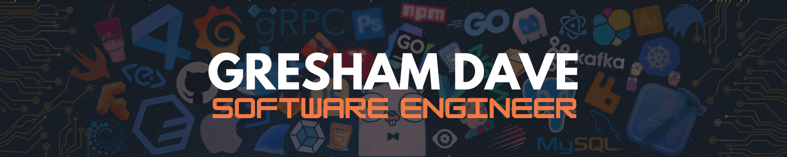
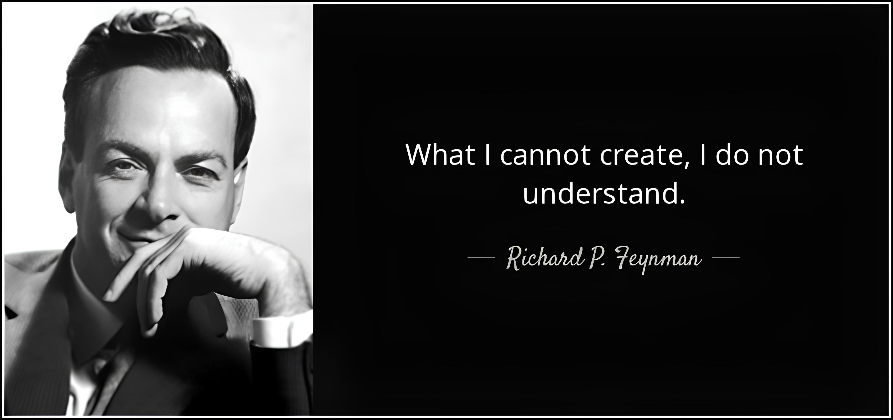

<div align="center">

<a href="https://gresham-dave-portfolio.vercel.app/"></a>

[](https://git.io/typing-svg)

<a href="https://gresham-dave-portfolio.vercel.app/"></a> <a href="https://linkedin.com/in/Gresham-Dave"></a> <a href="https://github.com/Greyash-Dave"></a>

</div> <br>

## About Me

```rust
struct Technologies {
    frontend: Vec<&'static str>,
    backend: Vec<&'static str>,
    ai: Vec<&'static str>,
    game_dev: Vec<&'static str>,
    currently_learning: Vec<&'static str>,
}

struct Developer {
    role: &'static str,
    specialization: Vec<&'static str>,
    technologies: Technologies,
    philosophy: &'static str,
}

fn main() {
    let gresham = Developer {
        role: "Software Engineer",
        specialization: vec!["Full-Stack", "Game Development", "AI/ML"],
        technologies: Technologies {
            frontend: vec!["React.js", "JavaScript", "HTML/CSS"],
            backend: vec!["Node.js", "Express", "Flask", "PostgreSQL"],
            ai: vec!["Python", "OpenCV", "scikit-learn"],
            game_dev: vec!["Unity", "Pygame"],
            currently_learning: vec!["Rust", "AI Wrappers", "Socket.IO"],
        },
        philosophy: "Learn fast, build faster, iterate continuously.",
    };
}

```

I build impactful and engaging applications that blend creativity with technical excellence. From leading hackathon projects to developing full-stack games, I thrive in environments that challenge me to innovate and learn continuously.

## Tech Stack

<div align="center">

   

     

      

</div>


##  GitHub Stats

<div align="center">  </div>

##  Work Style & Philosophy

<a href="https://gresham-dave-portfolio.vercel.app/"></a>

##  Connect With Me

<div align="center"> <a href="https://gresham-dave-portfolio.vercel.app/"></a> <a href="https://linkedin.com/in/Gresham-Dave"></a> <a href="https://github.com/Greyash-Dave"></a> </div>
